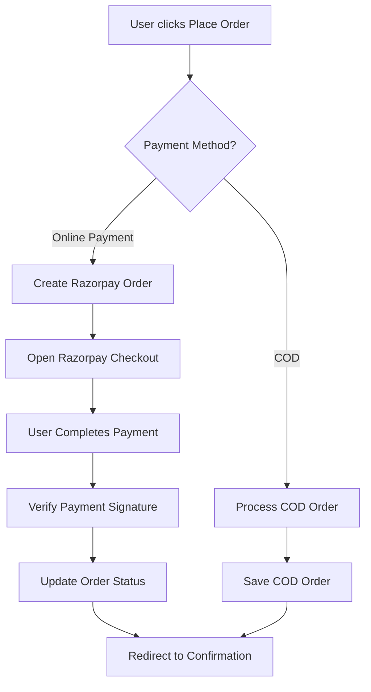

# 🚀 RAZORPAY PAYMENT GATEWAY SETUP GUIDE

## 📋 QUICK SETUP CHECKLIST

### ✅ **STEP 1: GET RAZORPAY CREDENTIALS**

1. **Create Razorpay Account:**
   - Visit: https://dashboard.razorpay.com/signup
   - Complete business verification (KYC)
   - Activate your account

2. **Get Test Credentials:**
   - Go to: https://dashboard.razorpay.com/app/keys
   - Copy your **Test Key ID** (starts with `rzp_test_`)
   - Copy your **Test Key Secret**

### ✅ **STEP 2: UPDATE CONFIGURATION**

Edit `backend/payment-config.js`:

```javascript
const PAYMENT_CONFIG = {
    RAZORPAY: {
        // Replace with YOUR actual test credentials
        KEY_ID: 'rzp_test_YOUR_KEY_ID_HERE',
        KEY_SECRET: 'YOUR_TEST_SECRET_HERE',
        
        // For webhooks (optional for testing)
        WEBHOOK_SECRET: 'your_webhook_secret',
        
        CURRENCY: 'INR',
        COMPANY: {
            NAME: 'Urban Nucleus',
            DESCRIPTION: 'Premium Fashion & Lifestyle',
            LOGO: 'https://yourdomain.com/logo.png',
            THEME_COLOR: '#000000'
        }
    }
};
```

### ✅ **STEP 3: START THE SERVER**

```bash
# From the root directory
npm start

# Or directly
cd backend
node server.js
```

### ✅ **STEP 4: TEST PAYMENT INTEGRATION**

1. **Add products to cart**
2. **Go to checkout page**
3. **Select "Online Payment"**
4. **Use test card details:**

#### 🧪 **TEST PAYMENT CREDENTIALS:**

**Credit Cards:**
- **Card Number:** `4111 1111 1111 1111`
- **Expiry:** Any future date (e.g., `12/25`)
- **CVV:** Any 3 digits (e.g., `123`)
- **Name:** Any name

**UPI (for testing):**
- **UPI ID:** `success@razorpay`
- **PIN:** Any 4-6 digits

**Net Banking:**
- Select any bank
- Use "success" credentials when prompted

---

## 🔧 **ADVANCED CONFIGURATION**

### **Webhook Setup (Optional for Production):**

1. **Create Webhook in Razorpay Dashboard:**
   - URL: `https://yourdomain.com/payment/webhook`
   - Events: `payment.captured`, `payment.failed`

2. **Update webhook secret in config**

### **Production Setup:**

1. **Switch to Live Mode:**
   - Get live credentials from Razorpay dashboard
   - Update `KEY_ID` and `KEY_SECRET` with live values
   - Set `NODE_ENV=production`

2. **Enable HTTPS:**
   - Required for production payments
   - Update domain URLs in config

---

## 🎯 **PAYMENT FLOW OVERVIEW**



---

## 💳 **SUPPORTED PAYMENT METHODS**

### **Online Payment (Razorpay):**
- ✅ **Credit Cards** (Visa, MasterCard, RuPay)
- ✅ **Debit Cards** (All major banks)
- ✅ **UPI** (Google Pay, PhonePe, Paytm, etc.)
- ✅ **Net Banking** (120+ banks)
- ✅ **Wallets** (Paytm, Mobikwik, etc.)
- ✅ **EMI** (Credit card EMI)

### **Cash on Delivery:**
- ✅ **₹200 advance payment** (for order confirmation)
- ✅ **Remaining amount** paid on delivery

---

## 🛡️ **SECURITY FEATURES**

- ✅ **PCI DSS Compliant** payment processing
- ✅ **Signature verification** for all transactions
- ✅ **Encrypted data transmission**
- ✅ **Fraud detection** and prevention
- ✅ **Secure webhook handling**

---

## 📊 **MONITORING & ANALYTICS**

View payment analytics in:
- **Razorpay Dashboard:** https://dashboard.razorpay.com
- **Transaction reports**
- **Settlement tracking**
- **Refund management**

---

## 🐛 **TROUBLESHOOTING**

### **Common Issues:**

1. **"Payment verification failed"**
   - Check KEY_SECRET in config
   - Ensure signature verification logic is correct

2. **"Order creation failed"**
   - Verify database schema is updated
   - Check API credentials

3. **Razorpay modal not opening**
   - Ensure Razorpay script is loaded
   - Check browser console for errors

### **Debug Mode:**
- Check browser console for detailed logs
- Monitor network requests in DevTools
- Review backend server logs

---

## 🎉 **YOU'RE ALL SET!**

Your payment gateway is now fully integrated and ready for testing! 

**Next Steps:**
1. Test with the provided test credentials
2. Verify order creation and payment flow
3. Check admin panel for order tracking
4. Move to production when ready

**Need Help?** 
- Razorpay Documentation: https://razorpay.com/docs/
- Support: support@razorpay.com
